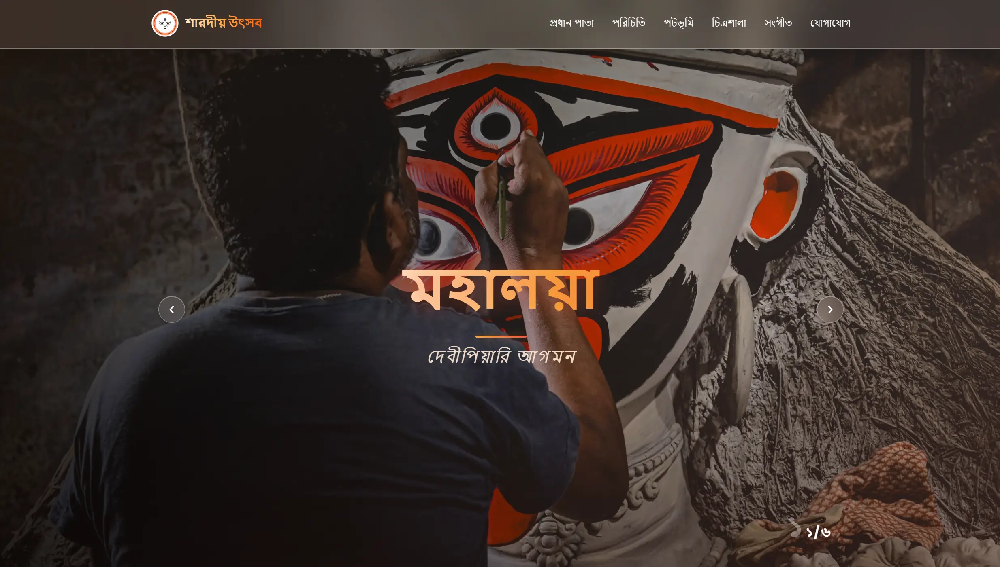

### ✨ A Digital Celebration of Durga Puja ✨

  
  
  
  

_"Wishing everyone a joyous and blessed Durga Puja"_

 

━━━━━━━━━━━━━━━━━━━━━━━━━━━━━━━━━━━

---

## 🖼️ Preview

  

<table>
  <tr>
    <td align="center" width="33.33%">
      
       
      <b>🏠 প্রধান পাতা</b>
    </td>
    <td align="center" width="33.33%">
      
       
      <b>👤 পরিচিতি</b>
    </td>
    <td align="center" width="33.33%">
      
       
      <b>📜 পটভূমি</b>
    </td>
  </tr>
  <tr>
    <td align="center" width="33.33%">
      
       
      <b>🖼️ চিত্রশালা</b>
    </td>
    <td align="center" width="33.33%">
      
       
      <b>🎵 সংগীত</b>
    </td>
    <td align="center" width="33.33%">
      
       
      <b>📞 যোগাযোগ</b>
    </td>
  </tr>
</table>

---

## ✨ Features

- 🏠 **Multi-page Navigation** — প্রধান পাতা, পরিচিতি, পটভূমি, চিত্রশালা, সংগীত ও যোগাযোগ পাতা সহ ৬টি সম্পূর্ণ সেকশন
- 📱 **Fully Responsive** — মোবাইল, ট্যাবলেট ও ডেস্কটপ সব ডিভাইসে সুন্দরভাবে কাজ করে
- 🖼️ **Interactive Gallery** — শারদীয় উৎসবের ছবি সংগ্রহ প্রদর্শনের জন্য চিত্রশালা সেকশন
- 🎵 **Music Section** — পূজার গান/সংগীত উপভোগের জন্য আলাদা পেজ
- 🎨 **Festive UI Design** — দুর্গা পূজার থিম অনুযায়ী রঙ ও ডিজাইন
- ⚡ **Fast & Lightweight** — অপ্টিমাইজড কোড, দ্রুত লোডিং টাইম
- 📞 **Contact Page** — যোগাযোগের জন্য সহজ ও ব্যবহারবান্ধব ফর্ম/তথ্য

---
